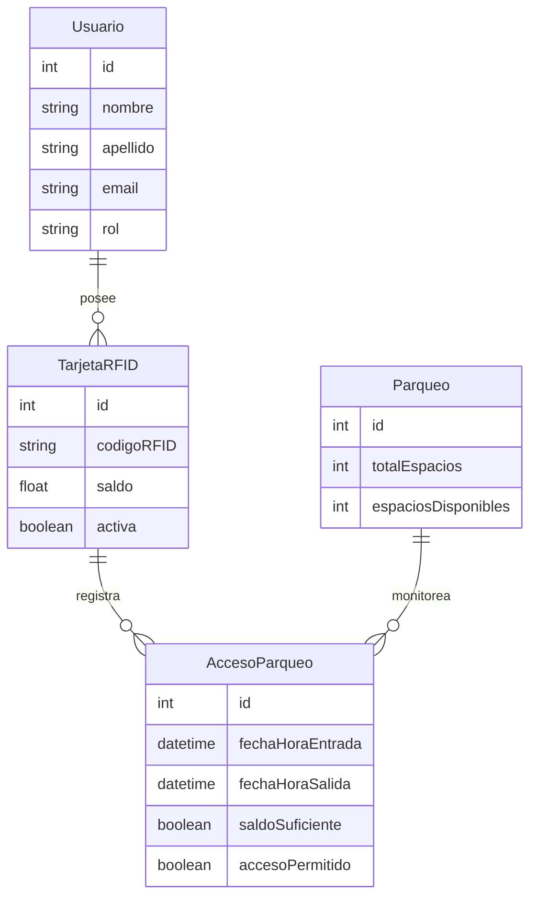

# Monitoreo de tráfico vehicular en parqueo de la Facultad de Ingeniería
## Fase 2
## ( Parking 4.0 y Smart Cities )

## Introducción
El presente proyecto tiene como objetivo implementar una solución basada en el Internet Industrial de las Cosas (IIoT) para gestionar de manera eficiente el parqueo de la Facultad de Ingeniería de la Universidad de San Carlos de Guatemala. Esta solución, denominada Parking 4.0, forma parte de una iniciativa más amplia enfocada en Smart Cities, y permite la automatización y optimización de los procesos relacionados con el control de acceso al parqueo. Utilizando tarjetas RFID, sensores y actuadores conectados mediante el protocolo MQTT, el sistema monitorea en tiempo real el estado del parqueo, gestiona los accesos de los usuarios mediante saldos prepagados, y permite una administración centralizada a través de una plataforma web. Con esta implementación, se busca mejorar la experiencia de los usuarios, optimizar el uso de los recursos disponibles y reducir el impacto ambiental generado por el tráfico vehicular dentro del campus.

## Descripción de la Solución
La solución implementada tiene como objetivo gestionar de manera eficiente el parqueo de la Facultad de Ingeniería de la Universidad de San Carlos de Guatemala, utilizando tecnologías basadas en el Internet Industrial de las Cosas (IIoT). En la Fase 2 del proyecto, conocida como "Parking 4.0", se integran nuevas funcionalidades que permiten controlar el acceso al parqueo mediante tarjetas RFID, gestionar saldos de los usuarios (estudiantes y administrativos), y monitorizar el estado del parqueo en tiempo real. Además, se utiliza el protocolo MQTT para la comunicación entre los dispositivos IoT y el servidor central, lo que permite una gestión más dinámica y eficiente de los recursos.

### Características principales
#### Gestión de Usuarios y Saldos
Las tarjetas RFID permiten registrar accesos al parqueo, verificando previamente el saldo disponible para los estudiantes. Los administrativos tienen acceso ilimitado al parqueo.

#### Monitoreo en tiempo real
Se pueden visualizar datos como el número de vehículos en el parqueo, espacios disponibles, y porcentaje de ocupación.

#### Protocolos IoT
Se utiliza MQTT para la comunicación entre los dispositivos de campo (talanqueras, sensores, etc.) y el servidor.

#### Interfaz de administración
Un administrador puede visualizar información sobre el parqueo, gestionar los usuarios y sus saldos a través de una página web.

El sistema contribuye a la optimización del uso de espacios y mejora la experiencia de los usuarios, al mismo tiempo que reduce el impacto ambiental y optimiza los recursos del parqueo.

## Capas del Framework de IoT
Este proyecto sigue el IoT Stack Connected Framework, un modelo que organiza los componentes del sistema en capas. A continuación, se describen las capas implementadas:

### Device Layer (Capa de Dispositivos)
Esta capa incluye los dispositivos físicos que interactúan directamente con el entorno, como las tarjetas RFID, los sensores de movimiento y los sensores de luz. Los lectores RFID permiten identificar a los usuarios y los actuadores controlan el acceso al parqueo a través de talanqueras.

### Communication Layer (Capa de Comunicación)
La comunicación entre los dispositivos y el servidor se realiza utilizando el protocolo MQTT, un protocolo ligero y eficiente que es ideal para entornos IoT. Los dispositivos publican y suscriben a diferentes topics para enviar y recibir datos, lo que facilita la interacción entre el parqueo y la base de datos central.

### Processing Layer (Capa de Procesamiento)
Los datos recopilados por los sensores y dispositivos son procesados en un servidor central. Este servidor utiliza los datos para verificar saldos, controlar accesos y actualizar el estado del parqueo en tiempo real.

### Application Layer (Capa de Aplicación)
En esta capa se encuentra la plataforma web de administración, que permite a los administradores gestionar los accesos al parqueo, visualizar el estado en tiempo real, y realizar operaciones sobre los usuarios (por ejemplo, actualizar saldos de las tarjetas RFID).

### Cloud Layer (Capa de Nube)
Aunque en esta fase del proyecto no se ha especificado el uso de servicios en la nube, el sistema está preparado para integrarse con plataformas de almacenamiento y procesamiento en la nube, lo que permitiría escalar el sistema para soportar más usuarios o ubicaciones.

## Modelo de la Base de Datos
El modelo de la base de datos propuesto sigue una estructura relacional que permite gestionar eficientemente la información de los usuarios, sus tarjetas RFID y los accesos al parqueo. A continuación, se describen las principales entidades del sistema:

- Usuario: Almacena la información personal de los usuarios del sistema (estudiantes y administrativos), incluyendo el nombre, correo electrónico y rol.
- TarjetaRFID: Contiene la información de las tarjetas RFID asociadas a los usuarios. Cada tarjeta tiene un saldo que se descuenta cada vez que el usuario accede al parqueo.
- AccesoParqueo: Registra cada entrada y salida del parqueo, incluyendo la fecha y hora, así como si el acceso fue permitido o denegado (por falta de saldo o parqueo lleno).
- Parqueo: Monitorea el estado del parqueo, como el número de vehículos presentes y los espacios disponibles.

### Diagrama ERD

### Detalle del Broker MQTT utilizado

### Topics y su Nomenclatura